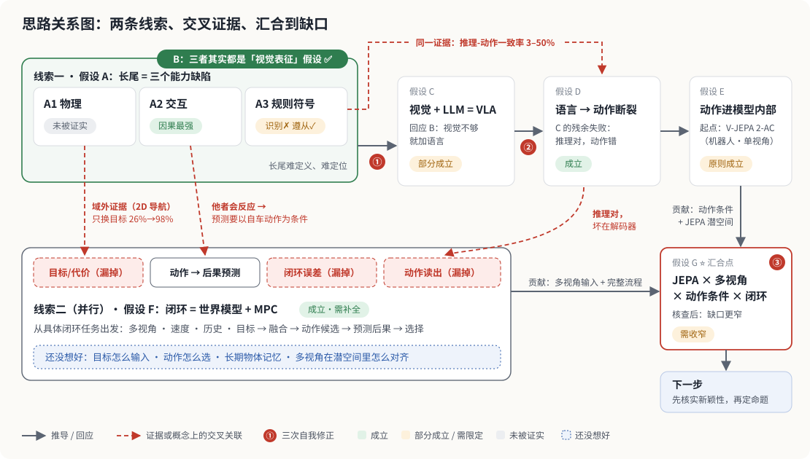
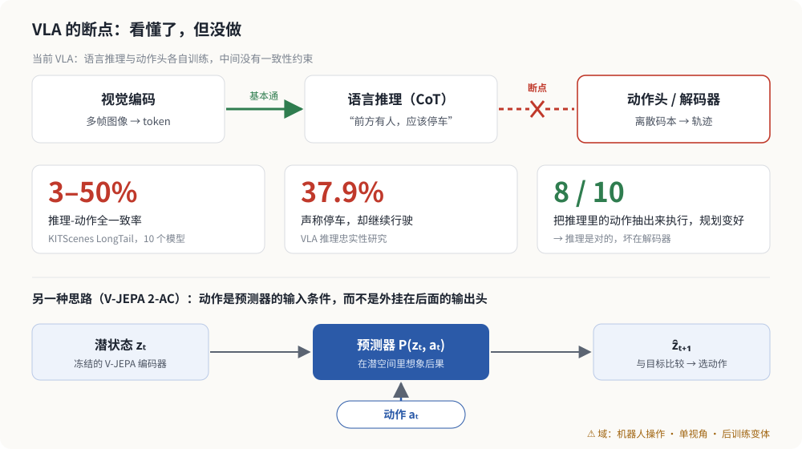
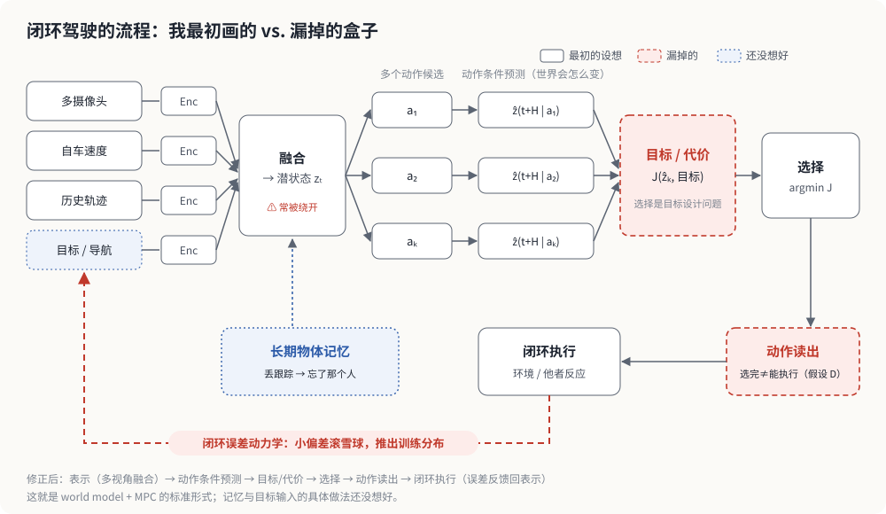
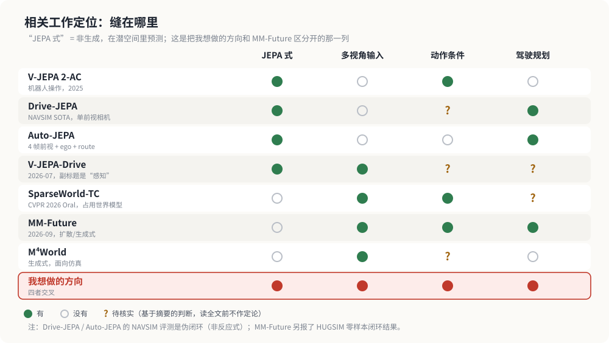

# 从「长尾成因」到「多视角 · 动作条件 JEPA」：一条研究思路是怎么被修正的

> 研究笔记 · 2026-10-02
>
> 这不是一篇结论性的论文，而是我**推理过程的记录**：我一开始怎么想、查了哪些相关工作、哪些想法被证据推翻或收窄，以及我现在停在哪里。写出来分享给组里，希望大家帮我找漏洞。

**怎么读这张图**：这条思路不是一条直线，而是**两条并行的线索，中间有交叉证据，最后汇合**。

- **线索一（上排）**：从"长尾的成因"出发。A 的三个假设被 B 重新归类为同一层（所以 B 画成套在 A 外面的标签），然后 A/B → C → D → E 依次推进。
- **线索二（下排）**：从"具体做一个闭环驾驶任务需要什么"出发，得到流程 F。它和线索一是**并行**想出来的，不是从 E 推出来的。
- **红色虚线是交叉关联**：A3 里"规则遵从"那一半和 D 用的是同一批证据；A1 查证时遇到的"只换目标就有效"变成了 F 里漏掉的"目标/代价"盒子；A2 说明后果预测必须以自车动作为条件；D 发现的"坏在解码器"变成了 F 里漏掉的"动作读出"盒子。
- **G 是汇合点**：E 贡献了"动作条件 + JEPA 潜空间"，F 贡献了"多视角输入 + 完整流程"，两者的交叉处才是我认为的缺口。

## TL;DR

- 我最初以为自动驾驶的长尾是三个**能力缺陷**造成的：物理、交互、规则符号。查完文献后发现，这三个假设**都落在"视觉表征"这一层**。其中"物理"这条，目前既没被证实也没被否证，只是**从来没人在驾驶闭环上测过**。
- 加上语言（VLA）在三条线上都有改善，但失败方式变成了**"看懂了不做"**：推理通常是对的，断点在**语言 → 动作**。
- 由此推出：**动作应该在模型内部被纳入**，而不是外挂一个动作头。V-JEPA 2-AC 是一个起点。
- 把闭环驾驶拆成流程以后，我发现自己漏了三个盒子：**目标/代价、动作读出、闭环误差动力学**。
- 我原以为"JEPA 还没做多视角"是一个大缺口。核查之后发现缺口**窄得多**：真正空着的是 **JEPA 式（非生成、潜空间）× 多视角 × 动作条件 × 闭环驾驶** 的交叉处，而且还需要先读完几篇全文确认。

**证据标注**：✅ 核实后成立｜⚠️ 部分成立/需限定｜❌ 核实后不成立｜❓ 待核实

---

## 目录

0. [起点](#0-起点)
1. [假设 A：长尾源于三个能力缺陷](#1-假设-a长尾源于三个能力缺陷)
2. [假设 B：这三个其实都是"视觉"假设](#2-假设-b这三个其实都是视觉假设)
3. [假设 C：加上语言（VLA）就能解决](#3-假设-c加上语言vla就能解决)
4. [假设 D：VLA 的问题是视觉、语言、动作不同步](#4-假设-dvla-的问题是视觉语言动作不同步)
5. [假设 E：V-JEPA 2-AC 是正确方向的起点](#5-假设-ev-jepa-2-ac-是正确方向的起点)
6. [假设 F：闭环驾驶需要什么样的流程](#6-假设-f闭环驾驶需要什么样的流程)
7. [假设 G：JEPA 系还没做多视角 ⭐](#7-假设-gjepa-系还没做多视角-)
8. [还没想好的问题](#8-还没想好的问题)
9. [下一步](#9-下一步)
10. [可信度说明与参考文献](#10-可信度说明)

---

## 0. 起点

自动驾驶落地最大的障碍之一是长尾：大部分场景都能开，但总有一些罕见场景会出事。我想弄清楚的问题很朴素：**长尾到底是因为什么？**

一路查下来，这个问题被我修正了三次（图中的 ①②③）：

1. 从"三个并列的成因"，变成"其实都是视觉方案的假设"；
2. 从"视觉不够"，变成"视觉 + 语言部分够了，但卡在对齐"；
3. 从"对齐问题"，变成一个具体的技术空白判断，而这个空白又在核查中被收窄了。

---

## 1. 假设 A：长尾源于三个能力缺陷

### 假设

> **A1** 模型没学到真实的物理效应。
> **A2** 模型没学会和他者的交互。
> **A3** 模型对规则和符号的识别较差。

### 检验（相关工作）

| 检验点 | 结果 |
|---|---|
| 物理一致性能不能测？ | ✅ 能测，而且确实差。V-JEPA 2-h 在 IntPhys 2 上总准确率 **57.51**，人类 **96.44**；Physics-IQ 上最好的视频模型只有 **29.5**（物理方差基线 100）。⚠️ 但这些都是**通用视频**基准，不是驾驶 |
| "补物理 → 长尾下降"有人做过吗？ | ❌ 在驾驶闭环上**没有找到**任何这样的消融实验 |
| 真实 ADS 失效分类里有"物理"这一类吗？ | ❌ 没有。Fu et al. 从加州 DMV 脱离报告和路测视频里归纳出 **16 类**功能不足，分属世界模型(8) / 交通规则(2) / 运动规划(3) / ODD(3)，**没有物理或动力学类目**（样本较小：32 段视频、9 个品牌） |
| 交互呢？ | ⚠️ **三者中因果证据最强**：关掉自车与他车的联合优化，nuPlan 闭环分 **0.86 → 0.62**；同一个 PDM-Closed，在常规基准 Val14 上 **92 分**，在长尾交互基准 interPlan 上只有 **42 分**。但效应只在"高交互密度 + 他者会反应"时出现，低交互密度场景几乎为零（**+0.14**） |
| 规则符号呢？ | ⚠️ 要拆开看。裁剪好的交通标志识别，机器已经**超过人类**（**99.46% vs 99.22%**），所以"识别差"不成立；但**罕见符号**（施工区零样本只有 **2.9–4.2 AP**）和**规则遵从/动作接地**（推理-动作一致率只有 **3%–50%**）确实有问题 |

### 修正后的认识

> [!NOTE]
> **长尾难定义。** Nature Communications 上关于 *curse of rarity* 的文章批评说，"long-tail challenge" 在文献里经常被随手使用，却**没有正式定义**。
>
> **长尾难定位。** 规模最大的 LLM 事故归因研究（NHTSA 的 2,168 起事故）自己报告：失效子系统识别准确率只有 **46%**，5 位专家彼此一致率 **53–67%**，**68%** 的案例信息不足以判断。所以，**任何"感知占 X%、规划占 Y%"的成因排序都不可靠**。
>
> **"物理"作为成因：未被证实，但也未被否证。** 准确的说法是"从来没人证明补物理能压缩长尾"，这是证据缺失，不是反证。

> [!WARNING]
> **一条自我提醒。** 我曾经把一个很漂亮的结果当作驾驶证据：只换规划目标函数、不重训预测器，长程目标达成率从 26% 升到 98%（arXiv:2608.12959）。后来核实，它的实验环境是 **TwoRoom，一个 2D 导航玩具环境**。这个结果说明"失败可以与物理无关"，但**不能当作驾驶证据**。这篇博客里凡是域外证据，我都会标出域。

---

## 2. 假设 B：这三个其实都是"视觉"假设

### 洞察

回头看 A1、A2、A3：物理表征、他者行为的感知与预测、视觉符号识别。**三者都预设瓶颈在"视觉系统学到了什么"**。

### 检验

- 三者分别对应物理表征、他者行为表征、符号表征，**全部在表征层**。
- 三者都没涉及：训练目标、闭环误差的累积、时序与延迟、动作执行。
- 这和一篇 2026 年安全综述的分层一致：**感知与表征 / 决策与规划 / 认知与逻辑**。该综述还主张，主导失败层会随架构范式**向上迁移**：模块化 → 端到端 → VLA。（D 类证据，只当组织框架用。）

### 结论 ✅

**成立。** 这是一次框架上的收窄：三个假设不是三个互相竞争的解释，而是**同一层上的三个候选**。这也解释了为什么它们"看起来都对，但都不够"。

---

## 3. 假设 C：加上语言（VLA）就能解决

### 假设

> 如果纯视觉方案不够，那就加上 LLM，做成 VLA。

### 检验（相关工作）

| 检验点 | 结果 |
|---|---|
| 长尾交互场景 | ✅ LLM 规划器（LLaMA-7B）把长尾基准从 **42 → 53**（事故现场 0 → 20，超车 9 → 28） |
| 规则推理 | ✅ SFT 后，多规则推理提升 **+29.7%** |
| 长尾泛化 | ✅ 推理模型在长尾数据集上明显优于传统端到端（MMS **5.06 vs 3.29**） |
| 车-人交互意图 | ✅ VLM 意图分类 **92.3%**（规则基线 78.4%），冲突数 124 → 33 |

### 结论 ⚠️

**部分成立。** VLA 在物理、交互、规则三条线上**都有实证改善**，所以"加语言"不是错的方向。

但在开源设置下仍然不够好，而且**失败方式换了**：不再是"看不懂"，而是**"看懂了不做"**。这就引出了假设 D。

---

## 4. 假设 D：VLA 的问题是视觉、语言、动作不同步

### 假设

> VLA 里的视觉、语言、动作三个模态没有对齐。

### 检验（相关工作）

| 证据 | 内容 |
|---|---|
| **KITScenes LongTail** | 推理里声明的动作和实际执行的动作，在 **50%–97%** 的场景里不一致；全一致率只有 **3%–50%**。冲突时，**推理通常是对的**。把推理里的动作抽出来直接执行，**10 个模型里有 8 个规划变好** |
| **VLA 推理忠实性研究** | 推理-动作一致性均值 **48.3%**；**37.9%** 的情况"声称停车却继续行驶"；轻微扰动下，**97.7%** 的轨迹变了，但解释没变 |
| **VLADriveBench** | 在部分架构里，CoT 只是**附带现象**：和动作相关，但没有因果作用 |
| **Compression Gap**（信息论分析） | 动作被固定容量的码本离散化时，**码本本身成为瓶颈**，编码器再强，信息也传不过去；放宽码本容量能部分恢复编码器的作用（因果证据） |

### 结论 ✅（目前最明确的一条）

**成立，而且断点被定位得很具体：不在"视觉 → 语言"，而在"语言 → 动作"。**

- 如果断点在视觉 → 语言，模型的推理应该是错的。但推理通常是对的。
- 断点在语言 → 动作：语言推理和动作头**各自训练，中间没有一致性约束**。
- 一个很说明问题的细节：有工作专门引入"动作先验 token"，目的之一是**不破坏预训练的 VLM 主干**。也就是说，工程上的默认做法就是**刻意把两者隔开**。
- 还有带宽问题：语言是低带宽的离散通道，动作是高频连续量。从"一句话"到"方向盘转角"要经过一个瓶颈，还要承受自回归解码的延迟。

> [!TIP]
> **由此推出的方向：让动作在模型内部就被纳入，而不是在主干后面外挂一个动作头。**

---

## 5. 假设 E：V-JEPA 2-AC 是正确方向的起点

### 观察

V-JEPA 2-AC 把动作作为**条件**放进潜空间预测器里（action-conditioned latent world model）：给定当前潜状态 zₜ 和动作 aₜ，预测 ẑₜ₊₁，再和目标比较来选动作（见上图下半部分）。据 V-JEPA 2 技术报告，它只用约 62 小时 Droid 机器人数据，就能零样本规划，pick-and-place 成功率 65%–80%。

### 检验

- ✅ 方向合理：它正好针对假设 D 找到的断点（动作与表征脱钩）。
- ⚠️ 但有三个限定：
  1. 域是**机器人操作**，不是驾驶；
  2. 它是 V-JEPA 2 的**后训练变体**，动作不是在基座预训练时就被纳入的；
  3. 输入是**单视角**。

### 结论 ⚠️

**"动作要进模型本身"这个原则成立，值得继承。** 但 V-JEPA 2-AC 不能直接搬到驾驶上：域不同，视角也不同。

---

## 6. 假设 F：闭环驾驶需要什么样的流程

### 我最初梳理的形式

- **输入**：多摄像头 + 自车速度（或近似）+ 历史 + 目标/导航命令
- **流程**：各自编码 → 融合 → 生成**多个动作候选** → **预测每个候选之后世界会怎么变** → **选一个** →（可能还需要）对同一物体的长期记忆

### 检验 1：这个形式对不对？ ✅

对，而且有现成的名字：这就是 **world model + MPC（模型预测控制）** 的标准形式。它也正在被独立验证：

- **SparseWorld-TC**（CVPR 2026 Oral）：轨迹条件的占用世界模型，即"给定候选轨迹，预测世界怎么变"。它的贡献主要在**表示的选择**：不做离散 token、绕开 BEV、用稀疏锚点。
- **Auto-JEPA**（NAVSIM v1 **91.3 PDMS** / v2 **89.1 EPDMS**）：不重建整个世界，只预测自车未来意图的潜表示。

### 检验 2：一个历史陷阱 ⚠️

**"融合"在历史上经常是假的。**

- 只用自车状态的 MLP，就能在开环指标上打平 UniAD / VAD；
- 把图像扰动、甚至换成空白图，**规划结果几乎不变**。

也就是说，融合接口名义上存在，但模型学会了**绕开视觉**。多模态融合与其说是难点，不如说是一个容易被忽略的假象：看起来在融合，其实没在用。

### 检验 3：我漏掉的三个盒子

| 漏掉的盒子 | 为什么重要 |
|---|---|
| **目标 / 代价** | "在多个未来里选一个"不只是搜索问题，更是**目标设计问题**。前面那个 2D 导航实验里，预测器其实很准，只换目标函数就从 26% 升到 98%。（⚠️ 域外证据） |
| **闭环误差动力学** | 我画的流程是一次性的，但闭环的主要失败模式是**滚雪球**：小偏差把状态推出训练分布，然后性能崩塌 |
| **动作读出** | "选出最好的未来"隐含了"选完就能执行"，但假设 D 的证据恰恰说明坏在解码这一步 |

**修正后的流程：**

> 表示（多视角融合）→ 动作条件预测 → **目标/代价** → 选择 → **动作读出** → **闭环执行**（误差反馈回表示）

---

## 7. 假设 G：JEPA 系还没做多视角 ⭐

这是整篇里最重要的一节，因为它决定"这个方向到底能不能做"。

### 假设

> V-JEPA 2.1、Auto-JEPA 等工作都没有做多摄像头输入，去年 CVPR 有一篇 Oral 也提到了这件事。所以这个问题还没被解决，可以做。

### 检验：一半成立，一半需要修正

**✅ 成立的部分：现有 JEPA 式驾驶规划器都是单视角。**

| 工作 | 输入 |
|---|---|
| **Drive-JEPA**（NAVSIM 上 93.7 PDMS / 87.8 EPDMS） | 原文强调只用了 "a single front-view camera" 加一个轻量 transformer 规划器 |
| **Auto-JEPA** | 4 帧**前视**图像 + 4 个历史自车位置 + 路线命令，送进冻结的 V-JEPA 2 编码器 |
| **V-JEPA 2 / 2.1** | 预训练是单路视频 |

**⚠️ 需要修正的部分："多视角 + 多个动作假设 + 预测未来 + 选择"已经有人做了。**

| 工作 | 做了什么 | 对我的影响 |
|---|---|---|
| **MM-Future**（arXiv:2609.20377，2026-09） | 把**多视角视频**压缩成面向规划的表示，生成**多组成对的场景-动作假设**，再用一个以未来为条件的打分器给候选轨迹排序。NAVSIM **94.0 PDMS / 91.5 EPDMS**，HUGSIM 零样本闭环 **32.3 HD-Score** | ❗ 几乎正好撞在第 6 节那条流程上。但它走的是**扩散/生成式**路线，不是 JEPA |
| **M⁴World**（arXiv:2607.14005） | 多视角 + 多模态（环视视频 + LiDAR）的**生成式**驾驶世界模型 | 多视角世界模型已经有了，但用途是**仿真和长尾数据增强**，不是闭环规划 |
| **V-JEPA-Drive**（2026-07） | 标题就是 V-JEPA + 多相机，但副标题写的是**感知** | ❓ **名字上最接近的一篇，必须读全文**。如果它只做多视角自监督感知预训练，那么规划这一块可能还空着 |

❓ 另外，我说的"CVPR Oral"，目前找到最接近的是 **SparseWorld-TC（CVPR 2026 Oral）**。它是占用世界模型，不是 JEPA。还需要确认我当时指的是不是这一篇。

### 修正后的结论

> [!IMPORTANT]
> **真正的缺口不是"多视角"，而是更窄的一条：JEPA 式（非生成、潜空间）的「多视角输入 + 动作条件 + 闭环规划」。**
>
> - Drive-JEPA / Auto-JEPA：JEPA + **单视角**
> - MM-Future：**多视角** + 多假设，但是**扩散/生成式**
> - V-JEPA 2-AC：**动作条件**，但域是**机器人**，且单视角
> - V-JEPA-Drive：**多视角 JEPA**，但可能是**感知**任务（待核实）
>
> 四者的交叉处目前看起来还空着。但这条缝比"多视角"窄得多，**动手之前必须先把新颖性核实干净**。

### 一个必须避免的误解

**"用了多视角"本身不构成贡献。** 比如 SparseWorld-TC 处理多视角重叠的方式，原文就是一句话：对多个视角采样到的特征 "aggregate by averaging"，**取平均**。

所以贡献必须落在**怎么融合**，或者**融合进什么样的表示**上，而不能停在"我用了 8 个相机"。

---

## 8. 还没想好的问题

| # | 问题 | 现在的线索 |
|---|---|---|
| 1 | **目标/导航命令怎么输入？** | 主流做法是把 route command 投影成 token（Auto-JEPA 就是这样）。它能不能作为**潜空间里的条件**？目标本质上和自车速度一样，是连续或结构化的意图，用离散的文字 token 来承载可能也是错的 |
| 2 | **预测的目标函数怎么设计？** | 我觉得这是最难的一个。线索是：瓶颈常在"打分标准"而不在"预测能力"（⚠️ 但那条证据来自 2D 导航）。另外，开环排名和闭环表现会脱钩甚至反转，所以**判据必须在闭环上定义** |
| 3 | **动作怎么选？** | 两条路：**生成**（模型直接输出动作），或**验证/排序**（规划器给候选，模型打分）。后者可能更容易，因为**识别坏动作比生成好动作容易**，而排序和验证正是视觉模型擅长的 |
| 4 | **怎么长时间记住同一个物体？** | 这是"状态一致性"问题。真实案例：Cruise 的 robotaxi 丢失了对一位行人的跟踪，于是"忘记"了这个人，起步时也就不知道刚刚碾过了人。这不是物理、交互或规则问题，而是**记忆/状态管理**问题 |
| 5 | **多视角在潜空间里怎么对齐？** | 走 JEPA 的话，多视角特征要进入同一个潜空间。可以靠几何（相机外参、自运动），也可以靠学习。BEV 时代主要靠几何，SparseWorld-TC 靠 deformable attention |

---

## 9. 下一步

### 写代码之前，必须先做的三个核实

1. **读 V-JEPA-Drive 全文**：它做的是感知还是规划？这直接决定缝还在不在。
2. **读 MM-Future 全文**：确认它是扩散/生成式而不是 JEPA，并弄清楚"多组场景-动作假设"具体是怎么做的。
3. **确认那篇 CVPR Oral 是哪一篇**。

### 把"多视角"变成一个有内容的命题

要么讲清**融合机制**（几何还是学习、有没有跨视角一致性约束），要么讲清**多视角带来了什么单视角拿不到的东西**，例如侧面切入车辆的可见性、遮挡的消解、自运动估计的精度。

### 实验设计上要防的三个坑

| 坑 | 怎么防 |
|---|---|
| **假融合**（模型绕开视觉走捷径） | 做**负对照**：遮住视觉输入后，性能必须显著下降。不降，说明融合是假的 |
| **开环指标骗人** | 必须用**闭环**评测。已有证据：开环排名第 5 的预测模型在闭环里是最好的；开环 ego-forecasting 与闭环表现甚至**负相关** |
| **自欺的新颖性** | 先把第 9 节开头的三个核实做完，再定命题 |

> [!TIP]
> **欢迎大家帮我挑刺。** 最想听到的反馈：
> 1. 你知道有哪篇工作已经占了"JEPA × 多视角 × 动作条件 × 闭环"这个交叉点吗？
> 2. 第 8 节的五个问题里，你觉得哪个最应该先做？
> 3. 有没有你觉得我推理链里跳得太快的地方？

---

## 10. 可信度说明

**已核实（✅）**
- Drive-JEPA / Auto-JEPA 是单视角（来自原文/摘要的明确表述）
- MM-Future、M⁴World 的存在与基本内容（读了摘要）
- 文中数字来自我们组内的四份分工调研报告及其引用核查（24 条关键数字逐条核对，23 条正确，1 条已更正）

**是我自己的判断（⚠️）**
- "三个假设都是视觉方案的假设"，是**我的推理框架**，不是文献结论
- "流程漏了三个盒子"，是**我的分析**
- 图 5 的格子里，部分判断只基于摘要

**待核实（❓）**
- V-JEPA-Drive 的实际任务（感知还是规划），**这一条最关键**
- 我所说的 "CVPR Oral" 具体是哪一篇
- Auto-JEPA 是否在别处做过多视角实验

**方法论提醒**
- 文中凡是域外证据（2D 导航、机器人操作、通用视频模型），都**不能直接当作驾驶证据**
- "物理"这条假设的强度已经下调：从"基本不成立"改为"**未被证实**"

---

## 参考文献

**长尾的定义、归因与失效分类**
- Liu & Feng. *Curse of rarity for autonomous vehicles.* Nature Communications, 2024. [链接](https://www.nature.com/articles/s41467-024-49194-0)
- Fu et al. *Characterization and Mitigation of Insufficiencies in ADS.* [arXiv:2404.09557](https://arxiv.org/abs/2404.09557)
- *CRASH: Cognitive Reasoning Agent for Safety Hazards in Autonomous Driving.* [arXiv:2603.15364](https://arxiv.org/abs/2603.15364)
- Koopman. *Lessons from the Cruise Robotaxi Pedestrian Dragging Mishap.* IEEE Reliability Magazine, 2024. [PDF](https://users.ece.cmu.edu/~koopman/cruise/Koopman2024_CruiseMishap_IEEEReliabilityMagazine.pdf)

**物理**
- Motamed et al. *Do generative video models understand physical principles?* (Physics-IQ), WACV 2026. [arXiv:2501.09038](https://arxiv.org/abs/2501.09038)
- *IntPhys 2: Benchmarking Intuitive Physics Understanding In Complex Synthetic Environments.* [arXiv:2506.09849](https://arxiv.org/abs/2506.09849)
- *The Objective Is the Bottleneck: Latent World Models Encode What Their Planners Cannot Use.* [arXiv:2608.12959](https://arxiv.org/abs/2608.12959)（⚠️ 2D 导航域）

**交互**
- *interPlan: Can Vehicle Motion Planning Generalize to Realistic Long-tail Scenarios?* [arXiv:2404.07569](https://arxiv.org/abs/2404.07569)
- *Interactive Joint Planning for Autonomous Vehicles.* [arXiv:2310.18301](https://arxiv.org/abs/2310.18301)
- *INTERACT: Interactive Planning for AVs via Anchor-Conditioned Prediction.* [arXiv:2609.31137](https://arxiv.org/abs/2609.31137)

**规则、符号与推理-动作接地**
- Stallkamp et al. *Man vs. Computer: Benchmarking ML Algorithms for Traffic Sign Recognition* (GTSRB). [PDF](https://www.ini.rub.de/upload/file/1470692859_c57fac98ca9d02ac701c/stallkampetal_gtsrb_nn_si2012.pdf)
- *ROADWork: A Dataset and Benchmark for Work Zones.* ICCV 2025. [arXiv:2406.07661](https://arxiv.org/abs/2406.07661)
- *DriveCombo: Benchmarking Compositional Traffic Rule Reasoning.* [arXiv:2603.01637](https://arxiv.org/abs/2603.01637)
- *KITScenes LongTail: Reasoning models do not yet follow their reasoning in autonomous driving.* [arXiv:2603.23607](https://arxiv.org/abs/2603.23607)
- *Is VLA Reasoning Faithful? Probing Safety of Chain-of-Causation.* [arXiv:2605.17268](https://arxiv.org/abs/2605.17268)
- VLADriveBench、Compression Gap（链接待补）

**JEPA 与世界模型**
- *V-JEPA 2* 技术报告. [arXiv:2506.09985](https://arxiv.org/abs/2506.09985)
- *Auto-JEPA: A Latent World Model of Continuous Intent for End-to-End Autonomous Driving.* [arXiv:2607.29031](https://arxiv.org/abs/2607.29031)
- *MM-Future.* [arXiv:2609.20377](https://arxiv.org/abs/2609.20377)
- *M⁴World.* [arXiv:2607.14005](https://arxiv.org/abs/2607.14005)
- Drive-JEPA、V-JEPA-Drive、SparseWorld-TC（CVPR 2026 Oral）（链接待补）

**开环与闭环的脱钩**
- *Is Ego Status All You Need for Open-Loop End-to-End Autonomous Driving?* CVPR 2024. [arXiv:2312.03031](https://arxiv.org/abs/2312.03031)
- Dauner et al. *Parting with Misconceptions about Learning-based Vehicle Motion Planning.* CoRL 2023. [PDF](https://www.cvlibs.net/publications/Dauner2023_CORL.pdf)
- *Motion Prediction Models beyond Open-Loop Benchmarks* (Closing the Loop). [arXiv:2505.05638](https://arxiv.org/abs/2505.05638)
- *Do Open-Loop Metrics Predict Closed-Loop Driving?* [arXiv:2605.00066](https://arxiv.org/abs/2605.00066)

---

图均为手绘 SVG，可直接在 GitHub 上渲染；如需修改文字，用任意文本编辑器打开 `figures/*.svg` 即可。
