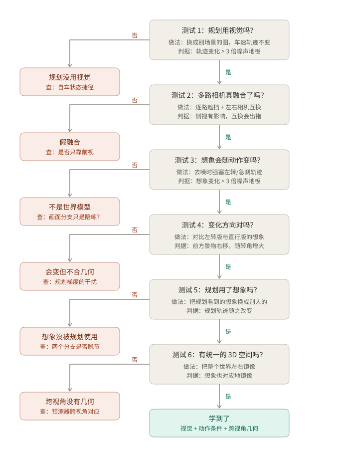

# WA-JEPA 诊断与改进：一个月方案 v0.2

> **撰写**：Claude（Anthropic · Claude Code · Opus 5.5）｜**日期**：2026-10-05｜**状态**：待审核
>
> **修订**：2026-10-07 Claude —— 新增 §1.1 诊断二叉树（图：`figures/wa-jepa-diagnostic-tree.svg`）

**被测对象**：WA-JEPA 发布权重（stage-2），本地代码 `research/papers/WA-JEPA/code/`（本地研究目录）
**目标**：用一个月，从"找出 WA-JEPA 的问题"做到"针对其中一个问题做出改进，并用同一套检验证明改进有效"。
**说明**：目前没有运行过任何实验，文中所有耗时和费用都是估算。第 0 周的冒烟测试会测出真实速度，届时再校正。
**标注**：✅ 已在本地代码或文档中核实 · ❓ 待核实 · 〔估〕按理论算力推算，误差可能在 2 倍以内

---

## 0. 词汇说明

| 词 | 意思 |
|---|---|
| **ego / 自车** | 我们开的这辆车。**不是相机。** |
| **4 路相机** | 左前 `cam_l0`、正前 `cam_f0`、右前 `cam_r0`、正后 `cam_b0` ✅ |
| **模型输入** | ① 4 路相机过去 4 帧的图像（约 2 秒）；② 自车过去 2 秒的轨迹；③ 自车状态 `ego_status`，包括导航指令（左转/直行/右转）、速度、加速度 ✅ |
| **模型输出** | ① 未来 4 秒的轨迹（8 个点）；② 对未来画面的"想象"，即预测的未来特征，不是真实图片 |
| **去噪循环** | 模型不是一步算出答案，而是从一团随机数开始分 4 步改草稿，每一步同时修改"轨迹草稿"和"画面草稿"。修改画面草稿时，会参考当前的轨迹草稿 ✅ |
| **噪声地板** | 输入完全不变，只换随机种子，输出也会轻微晃动。这个晃动幅度就是噪声地板。它不是 baseline |
| **hook（取样口）** | 在模型中间某一层装一个取样口，数据流过时复制一份存下来，模型本身完全不改。用来看模型内部算到一半的东西 |
| **一次推理** | 本文的计费单位：1 个样本 × 1 种输入条件 × 1 个随机种子，跑完整的 4 步去噪 |

---

## 1. 一个月要回答的三个问题

按"对后续工作的影响"排序：

1. **规划有没有用视觉？** 如果没用，模型开车主要靠"我刚才怎么开、现在多快"往下推，图像只是摆设。
2. **模型对未来的"想象"会不会随动作改变？** 也就是说，它是不是一个"给定动作 → 预测后果"的世界模型。
3. **4 路相机有没有被拼成一个统一的空间？** 还是四路各看各的。

然后从中**挑一个问题来优化**，优化完用同一套检验复测。

### 1.1 诊断二叉树

三个问题拆成 6 个依次进行的测试。**通过（是）就沿右侧主干往下，进入下一个测试；没通过（否）就分到左侧**：左边的叶子说明问题出在哪一层，以及下一步要查的"为什么"。走到哪一层分出去，问题就在哪一层；6 个都通过，才能说模型学到了。

**顺序的理由**：前面的测试是后面的前提。规划连图都不看（测试 1），讨论"多路相机融合得好不好"对驾驶就没有意义；想象不随动作变（测试 3），"变化方向对不对"（测试 4）也就无从谈起。

**执行上的灵活性**：严格按树走，走到左叶就停。但测试 1–3 只需要推理、成本很低，所以即使测试 1 判否，也可以顺手跑完测试 2、3，它们回答的是表征层面的问题，结果仍然有用。树真正决定的是：**之后的时间和算力投到哪片叶子的"查原因"上**。

| 树中的测试 | 对应第 4 节的实验 | 周次 |
|---|---|---|
| 测试 1 规划用视觉吗 | E1 (a)(b)(c) | 第 1 周 |
| 测试 2 多路相机真融合了吗 | E1 (d) + E3 的"只换槽位"测验 | 第 1 周 |
| 测试 3 想象会随动作变吗 | E2 ① | 第 2 周 |
| 测试 4 变化方向对吗 | E2 ② | 第 2 周 |
| 测试 5 规划用了想象吗 | E2 ③ | 第 2 周 |
| 测试 6 有统一的 3D 空间吗 | E3 镜像检验 | 第 2 周 |

---

## 2. 已核实的前提

| 事实 | 依据 | 影响 |
|---|---|---|
| 输入没有相机内外参、深度或 BEV | ✅ 在 `models/` 中 grep 无结果 | 只能检验隐式表征 |
| 4 路相机各自独立编码，编码器里没有跨视角交互 | ✅ `multiview_causal_future_jepa.py:1494` | ① 跨视角检验必须在预测器上做；② **省算力**：每路相机的编码结果可以缓存，单路干预时直接拼接，不用重算 |
| 相机身份是按槽位查表的嵌入，到预测器里才加上 | ✅ 同文件 L501–603 | 槽位置换实验可以直接做 |
| "想象"会参考轨迹草稿（scene 会 attend traj 的 k/v） | ✅ 同文件 L719–735 | 可以做动作反事实实验（E2） |
| 规划损失的梯度会流进画面分支（`traj_loss_grad_to_scene_flow: true`） | ✅ 配置 | "想象"不完全是世界预测，解释 E2 结果时要考虑 |
| 推理是 4 步去噪，每一步都显式写入轨迹草稿 | ✅ 同文件 L2440–2459 | E2 只需改几行代码 |
| 学生端特征和 teacher 端特征经过两个不同的投影头 | ✅ 同文件 L1737–1757 | 探针要按空间分开训练 |
| 帧间隔 0.5 s，tubelet = 2，所以一个潜变量步约 1 秒 | ✅ `NAVSIM_INTERVAL_S=0.5`，`tubelet_size: 2` | 物理检验只能在秒级尺度上做 |
| 参数量：可训练 4.81 亿，含 EMA 编码器共 7.88 亿 | ✅ 代码 README | 决定显存需求 |
| 官方训练：stage-1 用 64 张 A800，stage-2 用 32 张 A800，每卡 batch 4，bf16 + ZeRO-2 | ✅ 论文 §实验设置 | **从头复现不在一个月的预算内** |
| HUGSIM 每个场景约 8.5 GB 显存（3DGS 约 3.5 GB + 规划器约 4.9 GB）；436 个场景在"8 卡 × 每卡 4 场景"下约 3–5 小时 | ✅ `hugsim_closed_loop.md:161–177` | E7 的资源依据。文档没写用的是什么卡 ❓ |
| SAVE_VIZ 归档不存每路相机的输入，也不存特征 | ✅ `hugsim_client.py:223–266` | 离线分析改在 NAVSIM 上做 |
| NAVSIM 的 lidar 能不能直接用来做深度标签 | ❓ 代码的数据加载器没读 lidar | 拿不到就用 3D 框投影 |

---

## 3. 方法红线（违反任何一条，相关结论作废）

1. **不把模型自己的 teacher 当物理真值。** "对不对"只能由外部真值来判：3D 框、标定、lidar、仿真器状态。
2. **捷径的方向要写对。** 拿掉某路输入后指标不变，说明指标**不依赖**这路输入。推理时把输入置零属于分布外操作，只能算粗检。
3. **事先写定阈值**（见第 5 节），改动要在文档里留痕。
4. **改进必须有对照组。** 第 3 周做的任何微调，都要同时用**同样的步数、同样的数据、不做改动**再微调一份作为对照。否则涨分可能只是"多训练了几步"。
5. **标注证据等级。** 第一类：表征能被读出；第二类：干预后行为发生变化；第三类：闭环驾驶行为。不能越级下结论。

---

## 4. 实验（用大白话写）

每个实验都写四件事：做什么、读哪个数、什么结果说明什么、要多少算力。算力见第 6 节的统一表格。

### E0 · 跑通 + 测噪声地板（第 1 周前 2 天）
- **做什么**：加载发布权重，在少量 navtest 样本上跑通推理，挂好取样口（编码器输出、预测器中间层、最终的"想象"）。同一份输入换 10 个随机种子各跑一次。
- **读哪个数**：10 次输出之间的差异有多大。这就是噪声地板。
- **用途**：后面所有实验里，变化必须明显大于这个数才算数。
- **顺带**：测出每张卡上一次推理的真实耗时，用来校正第 6 节的估算。

### E1 · 规划有没有用视觉（第 1 周）

| 条件 | 做什么 | 结果说明什么 |
|---|---|---|
| 原样 | 不改 | 参照 |
| (a) 换图 | 场景 A 的车速、历史轨迹、导航指令都保留，**只把 4 路图像换成场景 B 的** | 轨迹几乎不变 → 模型开车基本不看图 |
| (b) 图像置零 | 4 路全部换成黑图 | 同上（分布外粗检） |
| (c) 去掉自车信息 | 图像不变，车速、历史轨迹清零 | 看光靠图像能撑多少 |
| (d) 逐路遮挡 | 每次只把一路相机换成黑图，共 4 次 | 只有正前有影响是正常的；**哪一路都没影响**就是"假融合" |

- **读哪个数**：规划轨迹和真实轨迹的误差（ADE/FDE），看它比"原样"变差了多少。
- **省算力**：编码器是每路独立的，换图和遮挡都可以直接拼接缓存好的编码结果，只需要重跑预测器。
- **官方分数 EPDMS** 只在最后全量确认时算。它要先生成 metric cache，CPU 开销大。

### E2 · "想象"会不会随动作改变（第 2 周，核心实验）
- **做什么**：在 4 步去噪的每一步，把轨迹草稿**强行换成我们指定的轨迹**，相当于问模型："假如我接下来这么开，你想象的未来是什么样？"
  - 指定 4 种动作：左转、右转、急刹、加速，每种 3 个强度，共 12 种。
  - 注入方式要配合当前步的噪声水平，不能直接塞一条干净轨迹，否则就是模型没见过的输入。
  - 这里改的是**具体轨迹**（车每 0.5 秒在哪），不是导航指令。改导航指令测的是"听不听指挥"，是另一个问题。
- **读哪个数**：
  - ① "左转版想象"和"原样想象"差多少，和噪声地板比；
  - ② 方向对不对：左转时前方景物在特征图上应该整体右移，右转则左移，移动量随转角单调增加；急刹时前车"放大"得更慢；
  - ③ 反方向检验：把轨迹分支看到的"想象"换成别的样本的，看规划变不变。
- **结果说明什么**：
  - ① 不超过噪声地板 → "想象"不管车怎么开，**不是世界模型，画面预测只是陪练的辅助任务**；
  - ① 过了、② 不对 → 会变，但变得不合几何；
  - ③ 规划不变 → 预测出的未来没有被规划使用。
- **注意**：规划损失会影响画面分支（第 2 节），所以 ① 通过不等于"物理正确"，要看 ②。

### E3 · 镜像检验：4 路相机有没有拼成一个空间（第 2 周）
- **做什么**：把整个世界照一面镜子，所有输入一起翻转：
  - 图像左右翻转；
  - 左前和右前两个槽位互换；
  - 历史轨迹、横向速度和横向加速度取反；
  - 导航指令左右互换。
- **读哪个数**：对比"镜像场景的想象"和"原场景想象再手动做镜像"，两者越接近越好。把这个差距除以"完全不等变时的差距"，得到一个 0 到 1 的比值。
- **两个辅助测验**：
  - 只翻转图像、不换槽位：误差应该明显变大，说明模型在用"哪个相机在哪个方向"这条信息；
  - 只换槽位、不翻转：如果输出几乎不变，说明四路图像对它来说只是"一袋图片"。
- **注意**：训练数据全是靠右行驶，所以**规划轨迹**本来就可能不对称。主读数看"想象"，轨迹只在直行、没有变道选择的场景里顺带看一眼。

### E4 · 单视角深度探针（第 2 周，有余力再做）
- **做什么**：在编码器输出上训练一个很小的线性探针，看能不能读出物体的距离、横向偏移和相对速度。标签由 3D 框投影得到。
- **读哪个数**：先只用"patch 在画面的哪个位置"去预测距离，再看加上模型特征后能多解释多少（ΔR²）。
- **对照组**：
  - 冻结的原版 V-JEPA 2.1：看 WA-JEPA 的训练增加了什么；
  - 随机初始化的模型：验证这把尺子能测出"坏模型"；
  - 同一帧重复 4 次：看速度信息是不是真的来自时序。

### E5–E7 · 推迟到一个月之后

| 实验 | 内容 | 推迟原因 |
|---|---|---|
| E5 跨视角对应 | 在相邻相机的重叠区域，检查预测器有没有把同一个物体对上 | 要先确认 nuPlan 前视三路的视场重叠有多大 ❓，工程量约 1 周 |
| E6 潜空间动力学 | 解码"想象"出的他车未来位置，和"保持当前速度外推"比 | 依赖 E4 在 teacher 空间训练的探针 |
| E7 HUGSIM 闭环 | 在不同距离、相对速度下插入车辆，看刹车反应是按碰撞时间（TTC）组织还是按画面大小 | 环境搭建、插车脚本和多 seed 闭环都很贵，资源估算见第 6.4 节 |

---

## 5. 从小数据到大数据：分档扩量规则

### 5.1 四个档位

| 档位 | 样本数 | 怎么抽 | 用途 |
|---|---|---|---|
| **T0 冒烟** | 20 | 2 段 log | 只验证流程能跑通，不出结论 |
| **T1 试点** | 300 | ≥ 30 段 log，每段最多 10 个；按"直行/转弯 × 低速/高速"分层 | 先看方向和大致效应量 |
| **T2 扩展** | 2,000 | ≥ 150 段 log，同样分层 | 大多数结论在这一档定下来 |
| **T3 全量** | navtest 全部（约 1.2 万）| 全部 | 只用于对外报告的数字（例如 EPDMS），或者前两档都判不清的情况 |

**为什么按 log 抽，而不是随便抽样本**：同一段 log 里相邻的样本几乎一样。抽 300 个样本如果全来自 3 段 log，实际信息量只相当于 3 个。所以分析和重采样的单位都是 **log**。

### 5.2 什么时候停、什么时候扩

每个实验在**跑之前**写定三样东西：噪声地板倍数（默认 3 倍）、"最小值得关心的效应"、显著性水平。最多看三次（T1、T2、T3），所以每次用 α = 0.05 / 3 ≈ 0.017，避免"多看几次总能看到显著"。

| 当前档位的结果 | 动作 |
|---|---|
| **差距很大**：效应 ≥ 5 倍噪声地板，按 log 做 bootstrap 的 CI 不含 0，并且随机把 log 分成两半各算一次、方向一致的比例 ≥ 80% | **停止**，结论成立，不再扩量 |
| **差距明确**：效应 ≥ 3 倍噪声地板，CI 不含 0，但没达到上一行 | 在 T2 停止；如果是在 T1 达到的，扩到 T2 确认一次 |
| **明确没有差距**：CI 上界小于"最小值得关心的效应" | **停止**，结论是"无效应" |
| **判不清** | 扩到下一档 |
| 要看**子群**（例如只看转弯、只看长尾场景） | 子群样本少，至少从 T2 开始 |

这就是你说的"小数据上差距已经很大，就不用全量跑"，只是事先把"多大才算很大"写死，防止看到结果再改标准。

---

## 6. 资源估算

### 6.1 可租的卡（2026-10 查询，价格变动很快，下单前以平台页面为准）

| 卡 | 显存 | 理论 bf16 算力（dense） | 国内参考价（AutoDL） | 海外参考价（RunPod / Vast.ai / Lambda） |
|---|---|---|---|---|
| RTX 4090 | 24 GB | 165 TFLOPS | ¥1.88/h | $0.34–0.74/h |
| RTX 5090 | 32 GB | 约 4090 的 1.3 倍〔估〕 | 约 ¥2.88/h（第三方横评）| 依平台而定 |
| L20 | 48 GB | 约 120 TFLOPS〔估〕 | 约 ¥3.68/h（第三方横评）| 少见 |
| L40S | 48 GB | 362 TFLOPS | 少见 | $0.39–1.09/h |
| A800 / A100 80GB | 80 GB | 312 TFLOPS | ¥5.59/h（A800）| A100：$0.50–2.79/h |
| H800 / H100 80GB | 80 GB | 约 990 TFLOPS | ¥9.98/h（H800）| H100：$0.90–3.99/h |
| RTX PRO 6000 | 96 GB | 依具体型号 | ¥6.98/h | 依平台而定 |

价格来源见文末。AutoDL 的 4090 常常抢不到卡；Vast.ai 是个人主机挂单，稳定性参差不齐。

### 6.2 一次推理要多少算力〔估〕

**算账过程**：
- 编码器（ViT-L，只处理历史帧，每路约 1024 个 token × 4 路）：约 3 TFLOP；
- 预测器（12 层，约 1.2 万个 token，跑 4 步去噪）：约 19 TFLOP；
- 合计约 22 TFLOP，**其中预测器占九成**。

所以只改单路输入的实验（E1）可以复用编码缓存，几乎全部开销都在预测器上。

| 卡 | 一次推理耗时〔估〕 | 每小时推理次数〔估〕 |
|---|---|---|
| RTX 4090 | 0.25–0.5 s | 约 1 万次 |
| L40S / A800 / A100 | 0.12–0.25 s | 约 2 万次 |
| H800 / H100 | 0.05–0.12 s | 约 4.5 万次 |

**推理显存**：权重按 bf16 约 1.6 GB，batch 8 时激活值只要几 GB。**24 GB 的 4090 足够做所有诊断实验。**

**CPU 和内存**：每个样本要解码 4 路 × 12 帧 = 48 张约 1080p 的 JPEG，这一步很容易成为瓶颈。建议每张卡配 ≥ 16 个 vCPU、≥ 64 GB 内存。另一个办法是在 T1/T2 档把解码缩放后的图像缓存到磁盘，此后每个条件、每个种子都不用重复解码。

### 6.3 每个实验在各档位的算力

| 实验 | 每样本推理次数 | T1（300）| T2（2,000）| T3（约 1.2 万）|
|---|---|---|---|---|
| E0 噪声地板 | 10（10 个种子）| 3 千次 | 2 万次 | 12 万次 |
| E1 视觉捷径 | 21（7 个条件 × 3 个种子）| 6.3 千次 | 4.2 万次 | 25 万次 |
| E2 动作反事实 | 70（14 个条件 × 5 个种子）| 2.1 万次 | 14 万次 | 一般不需要 |
| E3 镜像 | 20（4 个条件 × 5 个种子），另加 1 次编码 | 6 千次 | 4 万次 | 一般不需要 |
| E4 深度探针 | 4 次编码（3 个模型 + 单帧重复），不跑预测器 | 可忽略 | 约 10 分钟 | — |
| **前两周合计**（E0–E3 跑到 T2）| | | **约 28 万次** | |

换算成卡时和费用（前两周合计约 28 万次推理，**乘以 3 倍**留给调试和重跑）：

| 卡 | 纯计算时间 | 含 3 倍余量 | 费用（含余量）|
|---|---|---|---|
| RTX 4090 | 约 27 h | 约 80 h | AutoDL 约 ¥150；RunPod 约 $30–60 |
| A800 | 约 14 h | 约 40 h | AutoDL 约 ¥225 |
| H800 / H100 | 约 6 h | 约 20 h | AutoDL 约 ¥200；海外约 $20–80 |

**结论：诊断阶段的算力很便宜，一张 4090 就够。** 真正花时间的是写代码和看结果，所以按"租两周、每天开 8 小时"预算更实际：4090 约 ¥210，或 RunPod 约 $40–80。

**存储**：
- 特征缓存：编码器输出约 4 MB/样本，T2 档 3 个模型约 24 GB。只存物体附近的 patch 可以降到 5 GB 以内。
- 预测器中间层（E5 用）：约 38 MB/样本/3 层，只存重叠区域。

### 6.4 第 3 周的微调

| 项目 | 估算 |
|---|---|
| 训练显存 | 可训练 4.81 亿参数，AdamW 混合精度约 16 字节/参数，约 7.7 GB；EMA 编码器约 1.2 GB；再加激活值。官方在 80 GB A800 上每卡 batch 4、**没开**激活检查点 ✅ |
| 4090 能不能训 | 勉强。要开激活检查点、batch 1–2 ❓。消费卡之间没有 NVLink，多卡同步梯度会慢。**不推荐** |
| 推荐配置 | 4 张 A800/H800 80 GB（带 NVLink），≥ 64 vCPU，≥ 256 GB 内存，≥ 1 TB 磁盘 |
| 每份微调的量 | 约 1–3 个 navtrain epoch（每个 epoch 约 10 万样本）。官方 stage-2 大约训了 140 个 epoch〔估：112,840 步 × 128 ÷ 约 10.3 万〕，所以这只是一次小幅修改 |
| 每份耗时〔估〕| 每个样本训练约 33 TFLOP，H100 约 4–10 样本/秒（受 JPEG 解码限制）→ 每份约 10–40 H100 卡时 |
| 份数 | **2 份**：改进版 + 不做改动的对照版（红线 4） |
| 合计 | 约 20–80 H100 卡时。AutoDL H800 约 ¥200–800；A800 约慢 1.6 倍，费用相近；海外 H100 约 $40–300 |
| 对比 | 从头复现 stage-2 约 400–1000 H100 卡时〔估〕，**不在本月范围内** |

### 6.5 第 4 周的复测
- 改进版和对照版各自重跑 E0、E1，以及与所修问题对应的那一个实验，跑到 T2：约 2 × 10 万次推理。4090 约 20 h，H100 约 5 h。
- 如果要报官方 EPDMS：每个模型在 navtest 全量 × 10 个种子 = 12 万次推理，H100 约 3 h，另加 NAVSIM 打分的 CPU 时间 ❓（要先生成 metric cache，需要多核 CPU 跑几小时）。

### 6.6 HUGSIM 闭环（E7，本月不做，仅供预算）

| 项目 | 估算 |
|---|---|
| 显存 | 每个场景约 8.5 GB ✅。4090 每卡能并发 2 个，80 GB 卡能并发 4 个，文档说瓶颈在算力不在显存 ✅ |
| 一次全量 | 436 个场景，"8 卡 × 4 并发"约 3–5 h ✅，约 24–40 卡时（80 GB 级）|
| 多种子 | 闭环跨进程不确定，至少 3 个种子 × 2 个模型，约 150–240 卡时，H800 约 ¥1.5k–2.4k |
| 剂量-反应 | 20 个场景 × 5 个距离 × 3 个速度 × 3 个种子 = 900 次短 rollout，约 20 卡时，另加插车脚本的开发 |
| 数据 | HUGSIM 的 3DGS 场景资产有多大 ❓ 待查 |

### 6.7 数据与网络

| 数据 | 大小 | 什么时候需要 |
|---|---|---|
| WA-JEPA 发布权重 | 1.58 GB ✅ | 第 1 周 |
| V-JEPA 2.1 ViT-L 权重 | 5.15 GB ✅ | E4 对照组；NAVSIM 配置默认也要先加载它 |
| OpenScene test 传感器数据（含 navtest）| 约 217 GB（日志约 1 GB）| 第 1 周 |
| navtrain 传感器数据 | 约 445 GB（日志约 14 GB）| 第 3 周微调 |
| nuPlan 地图 | 若干 GB ❓ | 算 EPDMS 和生成 metric cache |
| 特征缓存 | 5–30 GB | 第 2 周 |

- **磁盘**：前两周 ≥ 500 GB；第 3 周 ≥ 1 TB。
- **下载速度**：217 GB 在 50 MB/s 下约 1.2 h，在 10 MB/s 下约 6 h。国内从 Hugging Face 下载可能很慢，可以用 NAVSIM 提供的 AWS 脚本或镜像站。
- **省钱技巧**：
  - AutoDL 等平台支持"无卡模式"开机（约 ¥0.1/h），用来下载数据和配环境；
  - T1 档只需要部分 log，如果 test 数据的分卷能按 log 单独下载 ❓，可以先只下一部分。
- **注意**：数据盘通常和实例绑定在同一地区，换卡型时要确认数据能挂载过去。

---

## 7. 一个月时间表

| 周 | 做什么 | 卡 | 产出 |
|---|---|---|---|
| **第 0 周**（可与第 1 周重叠）| 无卡模式下载 navtest、配置环境、跑 T0 冒烟 | 无卡 → 1 张 4090 | 流程跑通，测出真实推理速度，校正第 6 节 |
| **第 1 周** | E0 噪声地板 + E1 视觉捷径，T1 → T2 | 1 张 4090 | **结论一**：规划用不用视觉 |
| **第 2 周** | E2 动作反事实 + E3 镜像，T1 → T2；有余力再做 E4 | 1 张 4090 | **结论二、三**。**周末选定要修的问题，写定改法和判据** |
| **第 3 周** | 改进版和对照版各微调一份；同时下载 navtrain | 4 张 A800/H800 | 两个新 checkpoint |
| **第 4 周** | 用第 1–2 周**完全相同**的检验复测，对比，写结论 | 1 张 4090（如需 EPDMS 再加 H100）| 修好了没有，代价是什么 |

**第 2 周末怎么选要修的问题**：

| 发现的问题 | 第 3 周的改法 | 第 4 周用什么判断修好了 |
|---|---|---|
| 规划不看图（E1） | 微调时随机遮掉车速和历史轨迹（比如 50% 概率），逼模型看图 | E1 换图后的掉分明显变大，同时 ADE 不变差 |
| "想象"不跟动作走（E2 ①） | 训练时把**真实轨迹**（按噪声水平加噪）喂给画面分支，强化"动作 → 后果"的学习 | E2 ① 的变化量超过噪声地板，② 的方向正确 |
| 镜像检验没过（E3） | 训练时做镜像数据增强（整套输入一起翻转） | E3 的等变比值下降。**注意**：这是"教会"等变，不等于学会了 3D，结论要写得克制 |
| 三项都没问题 | 不硬改。转去做 E5/E6，或者回到长尾方案 | — |

**月度预算合计**：前两周 4090 约 ¥200（或 $40–80）；第 3 周 4 张 A800/H800 约 ¥200–800（或 $40–300）；第 4 周约 ¥100。**总计约 ¥500–1,100，或约 $100–450。** 不含 HUGSIM 闭环。

---

## 8. 止损线
- **第 1 周末**：E1 判定"规划不看图" → 第 2 周的 E2 和 E3 照做（它们回答的是表征问题），但第 3 周优先修 E1 这个问题。
- **第 2 周末**：E2 ① 和 E3 同时判负，并且 E1 也通过（即规划看图，但既不受动作条件控制、也没有跨视角几何）→ 结论本身就有价值，第 3 周可以只做 E2 方向的修改。
- **任何时候**：如果随机初始化的负对照在 E4 上表现和正式模型差不多，说明尺子本身有问题，先修指标再往下做。

---

## 9. 这份方案回答不了的问题
- **补上物理能不能压缩长尾**：需要用长尾方案 v0.2 做多模型族对比。
- **结论的适用范围**：只对发布的 stage-2 权重和 nuPlan 的 4 相机配置有效。stage-1 权重没有发布，所以分不开视频预训练和轨迹监督各自的贡献。
- **1 秒以下的物理过程**：超出潜空间的时间分辨率。
- **"能读出"不等于"在用"**：E4 只是第一类证据，要说"在用"得靠 E1、E2 ③ 和第 3 周的改进实验。
- **闭环驾驶能力**：本月没有第三类证据。

---

## 10. 与前两版的关系

| 来源 | 保留 | 删除 / 修改 |
|---|---|---|
| DS v0.1 | 红线、负对照、统计纪律、止损思路、冻结 V-JEPA 2.1 对照、残差探针思路 | 删除：H0（"查表 = 没学到 3D"，逻辑不成立；模型没有标定输入，查表正是隐式标定）；在 HUGSIM 归档上做三角化的 L2（测的是 GT 标定，不是模型；归档里也没有输入和特征）；三处写反的判死规则（L3-①、R2、L1-1）；"加装相机"实验（相机数写死为 4） |
| Claude 版 | 捷径检验、动作反事实、镜像等变的实验骨架；1 秒时间尺度的约束 | 修改：探针按学生端/teacher 端空间分开训练；镜像检验主读数从轨迹改为"想象"；补上阈值和分档扩量；E5–E7 推迟 |
| 本版新增 | 大白话术语表、分档扩量规则、租卡资源和费用估算、改进实验的对照组、"规划梯度流进画面分支"的解释限制 | — |

---

## 11. 需要你决定的点
1. **阈值**：默认"3 倍噪声地板（T1 提前停止需 5 倍）+ 按 log bootstrap 的 CI 不含 0"，是否同意？
2. **在哪租卡**：国内（AutoDL 等）还是海外（RunPod / Vast.ai / Lambda）？这会影响数据下载方案。
3. **第 4 周要不要报官方 EPDMS**：要的话，第 1 周就得开始生成 metric cache。
4. **第 3 周的卡**：能否接受 4 张 A800/H800 跑约 2–4 天？不行的话，改进只能缩小成"冻结编码器、只微调预测器"，4090 也能做，但改动幅度会受限。

---

**价格来源**（2026-10 查询）：
[RunPod: Top Cloud GPU Providers 2026](https://www.runpod.io/articles/guides/top-cloud-gpu-providers) ·
[Spheron: Runpod vs Vast.ai 2026](https://www.spheron.network/blog/runpod-vs-vastai-2026/) ·
[IntuitionLabs: H100 Rental Prices 2026](https://intuitionlabs.ai/articles/h100-rental-prices-cloud-comparison) ·
[gpuperhour.com](https://gpuperhour.com/) ·
[PromptQuorum: RunPod vs Vast.ai vs Lambda 2026](https://www.promptquorum.com/local-llms/cloud-gpu-rental-comparison-2026) ·
[AutoDL 官网](https://www.autodl.com/) ·
[知乎：2026 年 GPU 算力平台横评](https://zhuanlan.zhihu.com/p/2061142917868156382) ·
[搜狐：2026 年 6 月 4090 租卡攻略](https://www.sohu.com/a/1034858580_122654408)

**数据量来源**：[NAVSIM docs/splits.md](https://github.com/autonomousvision/navsim/blob/main/docs/splits.md)
